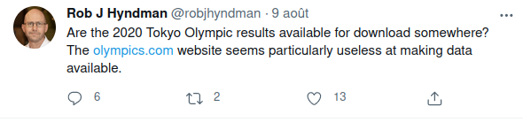

## TOKYO Olympics Games Athletes & Results

This repository is an attempt to give an answer to a [Professor Rob J Hyndman request.](https://twitter.com/robjhyndman/status/1424674757044170754)

## How Data is retrievied ?

I scrape the data from official [Olympics Website](https://olympics.com) using Selenium Driver with Python.

The script is in the <a href="2020 Olympics Games Results.ipynb">2020 Olympics Games Results.ipynb</a> notebook.

## Issues

On the [Olympics Website](https://olympics.com), some athletes data aren't available.
So I dont't include them.

## TODO

Retrieve some details on athlete bio page :
- Birth place
- Birth country
- Residence Place
- Residence Country

Last updated on 08/10/2021.
